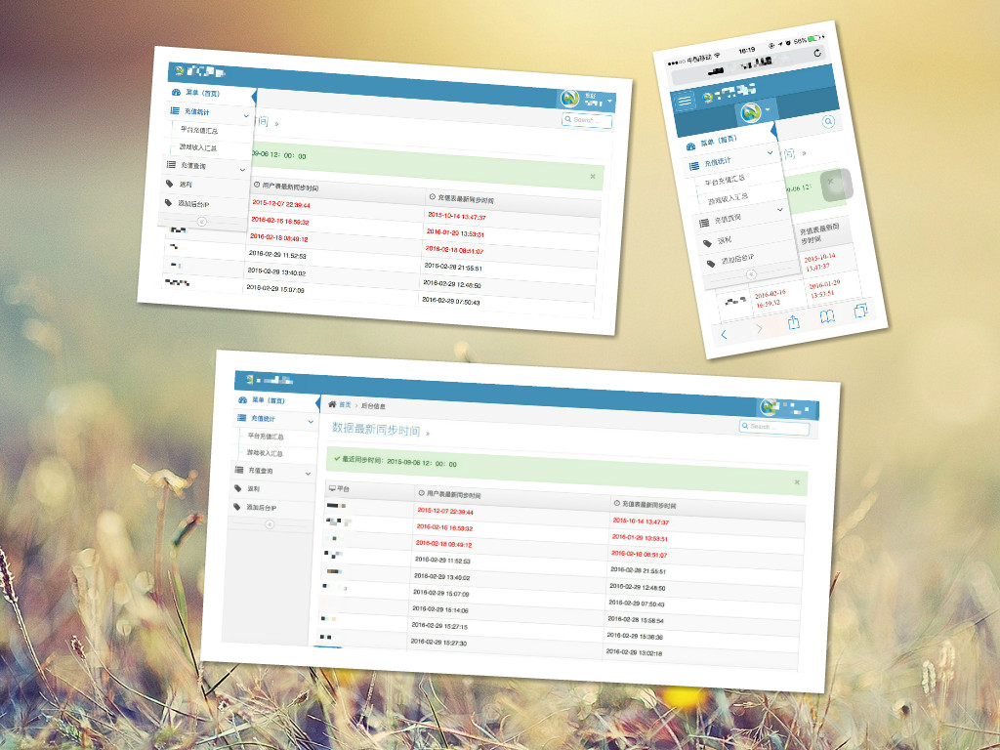
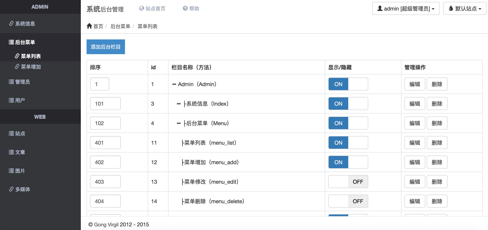

# 龚强/PHP程序员/简历 [][D1]

# 联系方式

- 手机：15262900637
- Email：gongvirgil@gmail.com
- 微信号：gongvirgil

---

# 个人信息

- 龚强/男/1993.3.12
- 本科/江苏大学计算机系(2009~2013)
- 工作年限：3年
- 技术博客：[http://gongvirgil.github.io/](http://gongvirgil.github.io/)
- Github：https://github.com/gongvirgil

- 期望职位：PHP程序员
- 期望薪资：税前月薪15k~20k
- 期望城市：北京

---

# 技能清单

熟练使用的技能

- Web开发：HTML+CSS+Javascript+Ajax & Linux/Nginx+Apache+MySQL+PHP (精通 使用3年以上)
- Web框架：jQuery/ThinkPHP/MVC模式/CMS/Discuz （精通 使用2年以上）
- 前端框架：Bootstrap （熟练 使用1年以上）
- 版本管理、自动化部署工具：Svn/Git （熟练 使用1年以上）
- 编辑器：Sublime Text 3

了解&使用过的技能

- HTML5/CSS3/React/Nodejs
- MemCache/Redis/MongoDB/Laravel 5
- Java/Python
---

# 工作经历

## 江苏易乐科技公司/Web全栈工程师 （ 2009年6月 ~ ）

运营技术支持，负责多个平台的以下事情：

- 平台游戏官网&活动
- API接口开发&对接
- 后台维护&功能开发
- 多端响应式自适应后台开发
- 服务器&数据库维护

---

# 主要的项目经验

### 游戏官网与活动

- 游戏官网/首页/文章页/列表页/选服页/游戏卡领取页
- 游戏抽奖活动/平台返利活动/积分兑换活动/游戏内部活动等

简述：各种常见的运营活动页面与程序，主要使用 `PHP+HTML+CSS+jQuery` 制作

### CPL&CPS广告

- 注册入口/Flash动画广告页面
- 广告注入API/等级查询API
- 提供给广告商的多级角色管理的运营数据后台

### 平台系统后台功能开发

- 充值数据API
- 注册用户数据API
- CPL渠道导量&充值API
- 数据导入导出，如Excel文档等

简述：根据运营同事的业务需求，提供各种数据接口，并在后台以表格、图表等形式显示或导出

### 手机端自适应后台

简述：PC端和手机端自适应的简易后台，便于在手机上处理业务，主要使用Bootstrap框架搭建前台模板

### Linux下服务器自动补单功能 

- Linux下的Crontab定时任务配置
- ThinkPHP开发后台补单API

简述：针对充值业务偶然出现的掉单现象，开发的自动补单功能

### Bootstrap风格系统管理后台

主要特点：

- Bootstrap简约风格
- 使用ThinkPHP框架
- 基于MVC模式开发
- 使用Widget扩展代替传统的iframe结构布局
- 基于角色访问控制的权限管理系统(RBAC)

---

# 开源项目和作品

项目|说明|演示
---|---|---
[profile-page][P1]|响应式自适应个人主页|[演示][S1]
[gongvirgil.github.io][P2]|使用Jekyll+Github Page搭建的博客|[演示][S2]
[bootstrap-admin][P3]|Bootstrap风格后台管理系统|[演示][S3]

---

# 致谢 

感谢您花时间阅读我的简历，期待能有机会和您共事。

[D1]: https://github.com/gongvirgil/resume/GongQiang_PHPer_Resume.pdf "PDF简历下载"

[P1]: https://github.com/gongvirgil/profile "profile"
[P2]: https://github.com/gongvirgil/gongvirgil.github.io "gongvirgil.github.io"
[P3]: https://github.com/gongvirgil/bootstrap-admin "bootstrap-admin"

[S1]: http://gongvirgil.github.io/profile/index-ch.html "个人主页"
[S2]: http://gongvirgil.github.io/ "莫离君的博客"
[S3]: http://ppmoli.esy.es/admin/ "后台管理系统"

