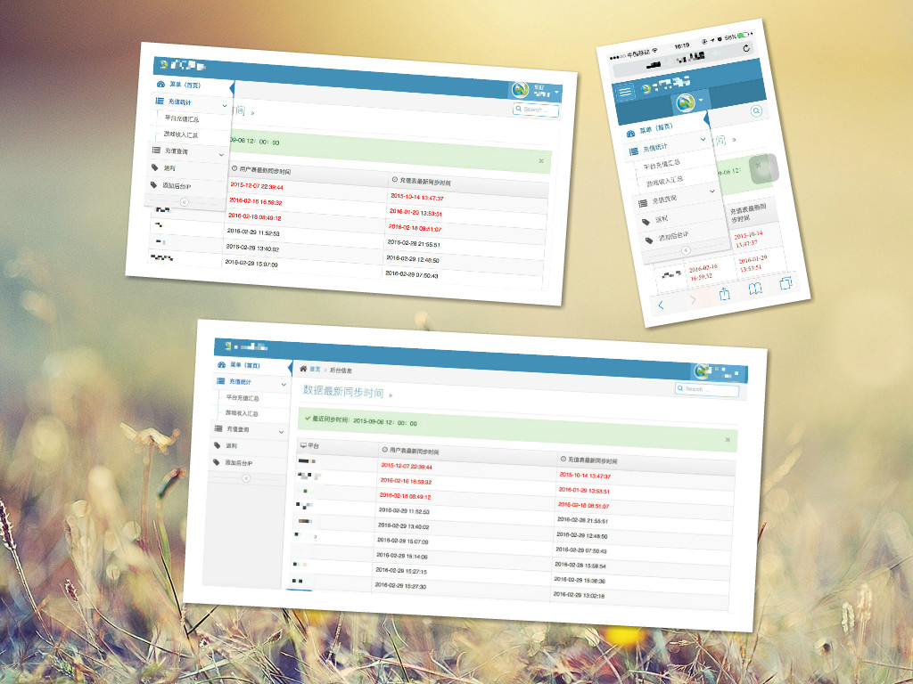

# 龚强/PHP程序员/简历 [][D1]

> 在线简历：[http://gongvirgil.github.io/resume/](http://gongvirgil.github.io/resume/)

# 个人信息

- 龚强/男/1993.3.12
- 手机：15262900637 / Email：gongvirgil@gmail.com
- 本科/江苏大学计算机系(2009~2013)
- 工作年限：4年
- 技术博客：[http://gongvirgil.github.io](http://gongvirgil.github.io)
- Github：[https://github.com/gongvirgil](https://github.com/gongvirgil)
- 期望职位：PHP程序员
- 期望薪资：23~28k
- 期望城市：北京

# 技能清单

> 熟练使用的技能

- Web开发：HTML+CSS+Javascript+Ajax & Linux/Nginx+Apache+MySQL+PHP (精通 使用3年以上)
- Web框架：jQuery/ThinkPHP/MVC模式/CMS/Discuz （精通 使用2年以上）
- 前端框架：Bootstrap （熟练 使用1年以上）
- 版本管理、自动化部署工具：Svn/Git （熟练 使用1年以上）
- 编辑器：Sublime Text 3

> 了解&使用过的技能

- MemCache/Redis/MongoDB/Laravel框架
- HTML5/CSS3/React/Nodejs
- Java/Python

# 工作经历

## 南京易米云通网络科技公司/WEB开发工程师	  ( 2016年4月 ~ )

> WEB后端开发,主要负责全国运维项目、呼叫中心项目、部分云总机项目.

### 主要项目

- ### 全国运维/超级总机

	- 同步几十台省运维服务器和企业服务器的数据
	- 提供面向全国的用户客户端和话机统一访问的超级总机接口

- ### 呼叫中心平台

	- 通话记录数据展现
	- CRM客户管理系统
	- 工单流转管理系统
	- IVR语音导航系统
	- 后台权限分级管理
	- 用户操作日志
	- 客户端统一接口

- ### 云总机平台

	- 改善老架构存在的问题,如大数据量异步导出的效率实现等
	- 客户端接口统一鉴权

## 江苏易乐科技公司/Web全栈工程师 （ 2013年6月 ~ 2016年4月 ）

> 运营技术支持，负责多个平台的以下事情：

- 平台游戏官网&活动
- API接口开发&对接
- 后台维护&功能开发
- 多端响应式自适应后台开发
- 服务器&数据库维护

### 主要项目

- ### 游戏官网与活动

	- 游戏官网/首页/文章页/列表页/选服页/游戏卡领取页
	- 游戏抽奖活动/平台返利活动/积分兑换活动/游戏内部活动等

	简述：各种常见的运营活动页面与程序，主要使用 `PHP+HTML+CSS+jQuery` 制作

- ### 接口API

	- 广告注入API/等级查询API
	- 充值数据API
	- 注册用户数据API
	- CPL渠道导量&充值API
	- 提供给广告商的多级角色管理的运营数据后台
	- 在线充值渠道对接
	- 与手游APP钱包接口对接交互

- ### 平台系统

- ### Bootstrap风格系统管理后台

	

	主要特点：

	- Bootstrap简约风格
	- 使用ThinkPHP框架
	- 基于MVC模式开发
	- 使用Widget扩展代替传统的iframe结构布局
	- 基于角色访问控制的权限管理系统(RBAC)

- ### 手机端自适应后台

	

	简述：PC端和手机端自适应的简易后台，便于在手机上处理业务，主要使用Bootstrap框架搭建前台模板

# 开源项目和作品

项目|说明|演示
---|---|---
[profile-page][P1]|响应式自适应个人主页|[演示][S1]
[gongvirgil.github.io][P2]|使用Jekyll+Github Page搭建的博客|[演示][S2]
[bootstrap-admin][P3]|Bootstrap风格后台管理系统|[演示][S3]

# 致谢 

感谢您花时间阅读我的简历，期待能有机会和您共事。

[D1]: https://gongvirgil.github.io/resume/GongQiang_PHPer_Resume.pdf "PDF简历下载"

[P1]: https://github.com/gongvirgil/profile "profile"
[P2]: https://github.com/gongvirgil/gongvirgil.github.io "gongvirgil.github.io"
[P3]: https://github.com/gongvirgil/bootstrap-admin "bootstrap-admin"

[S1]: http://gongvirgil.github.io/profile/index-ch.html "个人主页"
[S2]: http://gongvirgil.github.io/ "莫离君的博客"
[S3]: http://ppmoli.esy.es/admin/ "后台管理系统"

